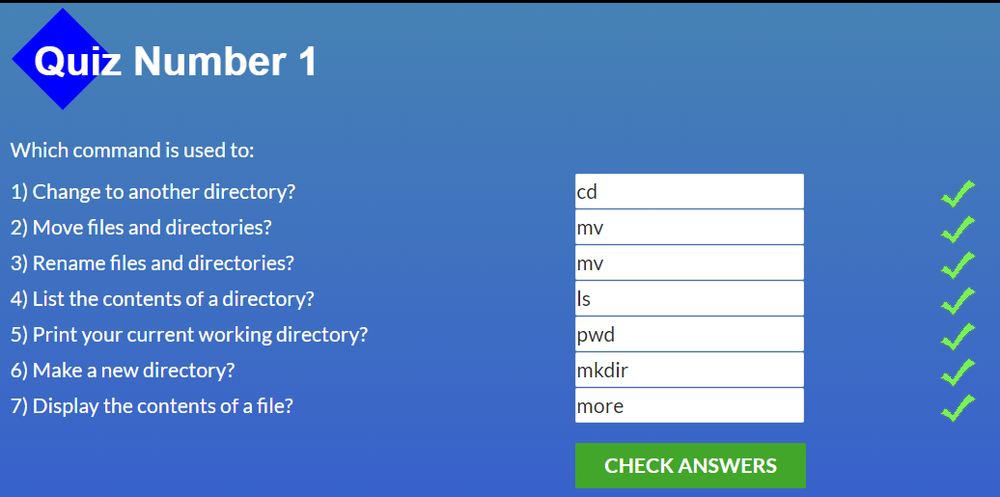
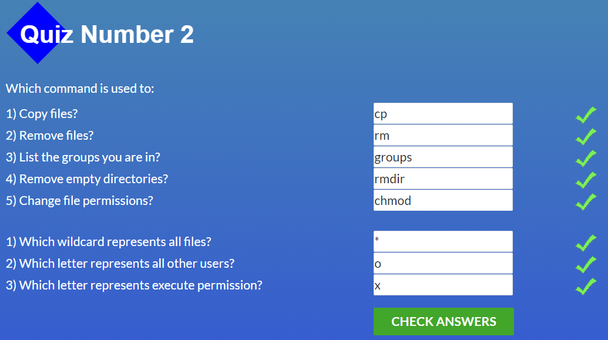
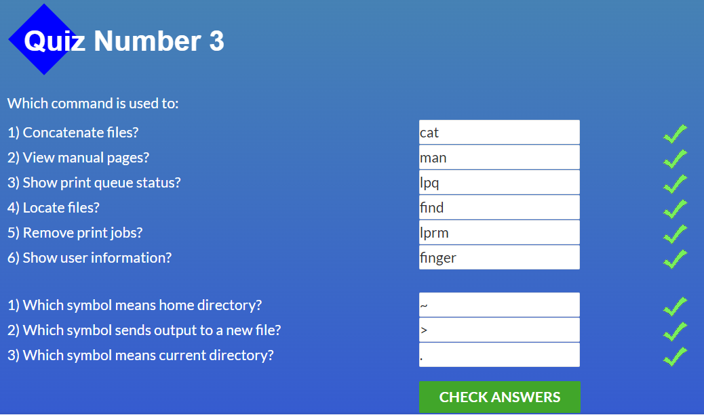
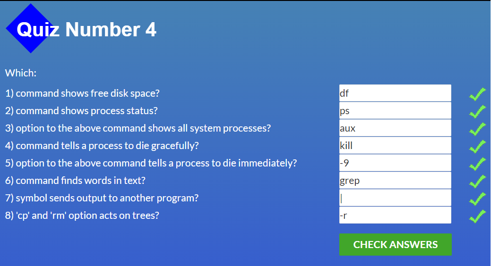

# kottans-frontend
Привіт тобі, невідомий відвідувач мого репозиторію. Англійську я ще вивчаю, тому поки що солов'їною. Вдячний, що ти тут. Ось тобі жарт для гарного настрою.

There are 10 types of people in this world, those who understand binary and those who dont :)

Мої враження від початку курсу позитивні з легким присмаком розчарування. Присмак від того, що задовго возився з Git`ом. Вже не дочекаюся практичних вправ. Бажаю тобі наснаги та терпіння, щоб дійти до кінця цього курсу!

## Linux CLI, and HTTP

Дякую за цей лікбез. Інформація і щодо Linux, і щодо HTTP була для мене новою та цікавою. 
Але вже швидче хочеться перейти до практичних вправ.